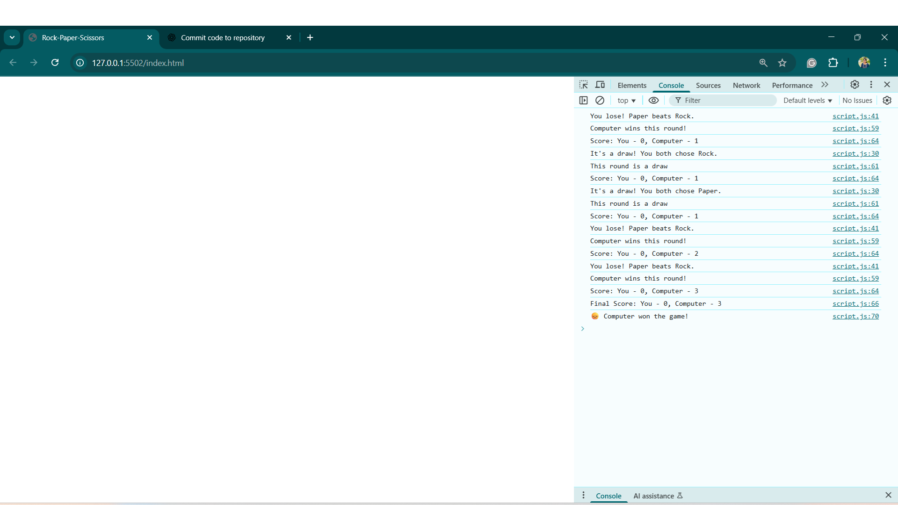

# Rock Paper Scissors Project

A beginner-friendly Rock-Paper-Scissors game built using HTML, CSS, and JavaScript. The player selects a move, the computer randomly picks its move, and the result is displayed instantly.

---

## Features:
- Player vs Computer mode  
- Real-time results: win, lose, or draw  
- Randomized computer moves  
- Score tracking  

---

## Technologies Used:
- HTML  
- JavaScript  

---

## How to Play:
1. Click Rock, Paper, or Scissors.
2. The computer picks a random move.
3. The winner is shown immediately.

---

## Screenshot


---

## Folder Structure:
/
├── README.md
├── images/
│ └── screenshot.png
├── index.html
└── script.js

---

## Pseudocode:
```text
SET playerScore = 0
SET computerScore = 0

FUNCTION getComputerChoice
    SET choices = ["rock", "paper", "scissors"]
    RETURN a random choice from choices

FUNCTION getHumanChoice
    PROMPT player to enter "rock", "paper", or "scissors"
    RETURN player's choice

FUNCTION capitalize
    RETURN word with the first letter capitalized

FUNCTION playRound(humanChoice, computerChoice)
    IF humanChoice == computerChoice THEN
        DISPLAY "It's a draw! You both chose [humanChoice]"
        RETURN "draw"
    ELSE IF (human beats computer) THEN
        DISPLAY "You win! [humanChoice] beats [computerChoice]"
        RETURN "human"
    ELSE
        DISPLAY "You lose! [computerChoice] beats [humanChoice]"
        RETURN "computer"

FUNCTION playGame
    SET totalRounds = 5
    FOR round = 1 TO totalRounds DO
        CALL getHumanChoice → humanChoice
        CALL getComputerChoice → computerChoice
        CALL playRound(humanChoice, computerChoice) → roundResult

        IF roundResult == "human" THEN
            INCREMENT playerScore
            DISPLAY "You win this round!"
        ELSE IF roundResult == "computer" THEN
            INCREMENT computerScore
            DISPLAY "Computer wins this round!"
        ELSE
            DISPLAY "This round is a draw."

        DISPLAY current score: "You: [playerScore] | Computer: [computerScore]"
    END FOR

    DISPLAY "Final Score - You: [playerScore], Computer: [computerScore]"

    IF playerScore > computerScore THEN
        DISPLAY "🎉 You won the game!"
    ELSE IF playerScore < computerScore THEN
        DISPLAY "😞 Computer won the game!"
    ELSE
        DISPLAY "🤝 The game is a draw!"
